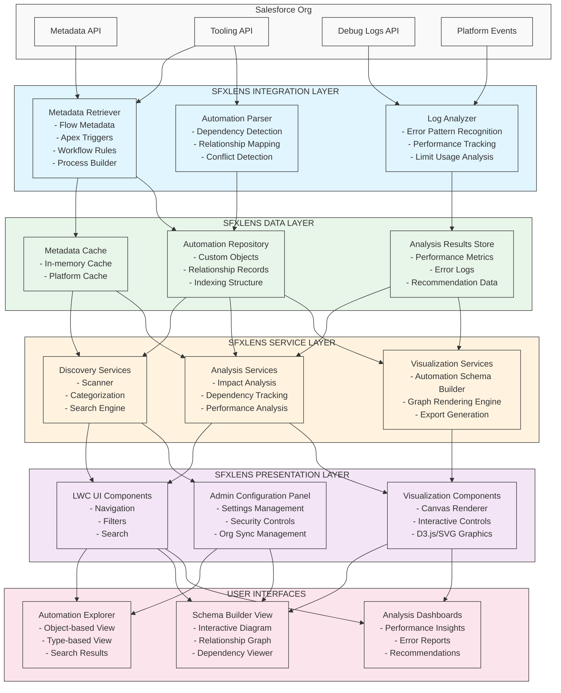

# Salesforce Automation Explorer - High-Level Architecture

## Architecture Components

### Integration Layer
- **Metadata Retriever**: Interfaces with Salesforce APIs to fetch automation metadata
- **Automation Parser**: Analyzes raw metadata to extract relationships and dependencies
- **Log Analyzer**: Processes debug logs to identify performance patterns and errors

### Data Layer
- **Metadata Cache**: Stores recently accessed metadata to reduce API calls
- **Automation Repository**: Custom objects that store parsed automation details
- **Analysis Results Store**: Persistent storage for analysis findings and metrics

### Service Layer
- **Discovery Services**: Handles finding and categorizing automations
- **Analysis Services**: Performs impact analysis, dependency tracking, and performance analysis
- **Visualization Services**: Generates visual representations of automation relationships

### Presentation Layer
- **LWC UI Components**: Reusable Lightning Web Components for the user interface
- **Visualization Components**: Specialized components for rendering diagrams and charts
- **Admin Configuration Panel**: Interface for administrators to configure the application

### User Interfaces
- **Automation Explorer**: Primary interface for browsing and searching automations
- **Schema Builder View**: Interactive visualization of automation relationships
- **Analysis Dashboards**: Performance insights and recommendations

## Data Flow

1. The Integration Layer fetches metadata from Salesforce APIs
2. Raw metadata is parsed, analyzed, and stored in the Data Layer
3. The Service Layer uses this data to provide discovery, analysis, and visualization services
4. The Presentation Layer renders the data through Lightning Web Components
5. Users interact with the interfaces to explore, analyze, and optimize their Salesforce automations

## Security Controls

- Permission sets control access to the application and its features
- Field-level security ensures sensitive metadata is properly protected
- Logging tracks all user interactions for audit purposes
- Caching is secured through encryption and proper data handling

## Scalability Considerations

- Batch processing for large metadata operations
- Lazy loading of visual components for performance
- Background processing for intensive analysis operations
- Configurable refresh intervals to manage API call volumes
